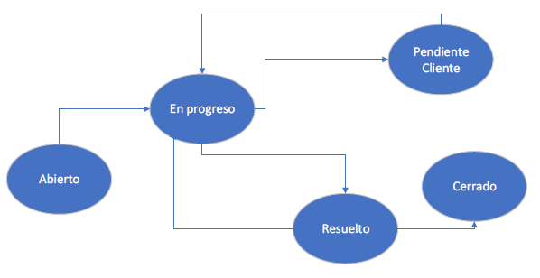

# CallCenterDB
Diseño integral de una base de datos SQL. Incluye diagramas DER y DLR. Manejo de errores, funciones, triggers, stored procedures

Requerimientos:

En un call center de una empresa de telecomunicaciones se atienden los reclamos de sus clientes y prospectos. Una persona siempre es inicialmente creada como “Prospecto”. Esto permite asociarle tickets u oportunidades de venta. Luego, cuando contrata servicios, pasa a ser un cliente activo.

Se guardan los siguientes datos de los clientes/prospectos:
    • Nombre y Apellido: Estos datos solo pueden modificarse mientras sea un prospecto
    • Tipo y número de documento: Estos datos solo pueden modificarse mientras sea un prospecto. No puede haber dos personas con el mismo tipo y número de documento. Se debe validar que sea un número de documento válido (numérico de ocho de largo)
    • e-mail (no es obligatorio para prospectos, aunque puede ingresarse). Debe ser un mail válido – Siempre puede modificarse
    • fecha de nacimiento (No es obligatorio para prospectos, aunque puede ingresarse). La edad debe ser mayor a 18 años para que pueda ser dado de alta.

Se mantiene además un estado que toma los valores de acuerdo con las siguientes reglas:
    • Activo: si tiene algún servicio vigente
    • Inactivo: si alguna vez fue cliente y no posee servicios actualmente por lo cual fue inactivado
    • Prospecto: si nunca fue cliente y llamó por alguna consulta o tiene oportunidades de venta.

Los campos Nombre, Apellido, Tipo de documento, número de documento y fecha de nacimiento solo pueden ser modificados cuando la persona tiene el estado “Prospecto”

La compañía vende los siguientes servicios los cuales son contratados por los clientes:
    • Telefonía fija
    • Internet
    • VOIP

Cuando un cliente contrata uno de estos servicios se deben almacenar los siguientes datos del servicio del cliente:
    • Número de Servicio: se debe autogenerar
    • Teléfono: Debe ser ingresado y es obligatorio para los servicios correspondientes a Telefonía fija y VOIP. Para el caso de Internet no debe almacenarse.
    • Dirección (calle, número, piso y depto): Obligatorios para todos los servicios
    • fecha de inicio del servicio. Se genera automático cuando se da de alta el servicio
    • estado (Activo e Inactivo)

Los tickets siempre están asociados a la persona que llama y adicionalmente pueden también ser asociados a alguno de los servicios de la persona (en esos casos es un cliente activo):

    • Si un cliente llama por un problema relacionado con alguno de sus servicios, el ticket debe
    estar asociado al cliente y al servicio por el cual se reclama
    • Si un cliente/prospecto llama por una consulta o queja general no asociada directamente a
    uno de sus servicios, el ticket deberá ser asociado al cliente (o prospecto) únicamente
    • Si llama una persona no registrada ni como cliente ni como prospecto se lo deberá
    inicialmente crear como prospecto y luego crear el ticket asociado al mismo.

A los tickets se les asocia una tipología. Esta identifica el motivo por el cual se crea el ticket. Ejemplo de tipología son:
    • Reimpresión de Factura
    • Servicio Degradado
    • Baja de Servicio
    • Facturación de Cargos Erróneos
    • Cambio de Velocidad
    • Mudanza de servicio

Por disposición del ente regulador, cada una de las tipologías debiera resolverse dentro de un tiempo máximo (expresado en horas). Esto se denomina Service Level Agreement (acuerdo de nivel
de servicio) y se conoce como SLA (puede haber un SLA diferente por cada tipología y tipo de producto asociado). El ente regulador puede auditar los tickets existentes y aplicar multas a la compañía en el caso que no se cumpla el SLA en más de un determinado porcentaje de todos los tickets (fijado como normativa).

Cada tipo de servicio posee distintas tipologías habilitadas. También existen ciertas tipologías disponibles en los casos que no se esté asociando ningún servicio al ticket.

El ticket posee además un estado (Abierto, En Progreso, Pendiente Cliente, Resuelto y Cerrado) con las siguientes transiciones posibles. Un ticket siempre se crea inicialmente en estado Abierto

Se debe registrar automáticamente en cada ticket la fecha de resolución (última vez que pasa a Resuelto). Se desea saber qué tickets cumplieron con el SLA y cuáles no.

Para saber si un ticket cumplió con el SLA o no, se debe poder calcular el tiempo de resolución de acuerdo con las siguientes reglas:

    Fecha/Hora de Resolución – Fecha/Hora de Apertura - ΣTiempo que el ticket se encuentra en el estado Pendiente Cliente

Se poseen además actividades asociadas a los tickets. Las actividades indican las distintas acciones que se realizan para llegar a la resolución.

Ejemplo de actividades son:
    • Reinicio Router
    • Cambio de cableado interno
    • Envío de factura
    • Cambio Bajada Cableado desde Azotea

Los tickets tienen además los siguientes campos:
    • Fecha de cierre
    • Dueño del Ticket: Es un empleado del que se guardan, nombre, apellido, login y estado (activo, inactivo)

Se poseen además las siguientes reglas:
    • Un cliente está activo cuando tiene al menos un servicio activo. Es decir, si está inactivo o es un prospecto, y contrata un nuevo servicio se cambiará el estado del cliente a Activo.
    • En caso contrario, si se desactiva un servicio de un cliente y este era el único servicio que tenía activo, el cliente pasará a Inactivo.
    • Se debe enviar un e-mail notificando al cliente cada vez que se cambie el estado de un ticket. Por esta razón, se requiere generar registros en una tabla que será leída por el software encargado de enviar los emails (solo se llena una tabla, no se debe enviar el email)
    • Se debe permitir reasignar un ticket siempre que no se encuentre cerrado. El usuario al que se le intenta asignar debe estar activo
    • Todos los cambios los puede hacer únicamente el dueño del ticket

Se deben cubrir los siguientes casos:

Condición Resultado Esperado
Alta de un nuevo Cliente El cliente se debe generar como Prospecto
Intentar dar de alta un cliente (prospecto) sin datos mínimos requeridos o erróneos (probar las distintas alternativas de campos)
Se debe devolver el error correspondiente
Crear un nuevo servicio a un Prospecto
Debe crearse el servicio y cambiarse el cliente a Activo
Se debe crear el servicio activo
Crear un nuevo servicio a un Cliente Inactivo
Debe crearse el servicio y cambiarse el cliente a Activo
Se debe crear el servicio activo
Intentar crear un servicio a un prospecto que no tiene email o fecha de nacimiento
Debe devolver un error
Inactivar un Servicio a un cliente con un solo servicio activo
Se inactiva el servicio y el cliente
Inactivar un Servicio a un cliente con más de un servicio activo
Se inactiva el servicio
Generar un nuevo ticket
Ticket Creado en estado Abierto con el usuario creador como dueño
Cambiar el estado de un Ticket a un estado diferente de resuelto (transición permitida)
Se debe cambiar el estado del ticket
Debe generarse un registro en la tabla de emails
Cambiar el estado de un Ticket a Resuelto
Se debe cambiar el estado del ticket con fecha de resolución
Debe generarse un registro en la tabla de emails
Intentar realizar un cambio a un estado no permitido
Se debe devolver error
Reasignar un Ticket abierto a un usuario activo
Ticket reasignado al nuevo usuario
Intentar reasignar un Ticket a un usuario Inactivo
Se devuelve un error
Cambiar el estado de un Ticket a Cerrado
Se cambiar el estado y registrar la fecha y hora del cambio.
Intentar hacer cualquier cambio del ticket con un usuario diferente al dueño
Devolver un error
Intentar modificar el nombre o apellido para un cliente activo
Devolver un error
Modificar el nombre, apellido o fecha de nacimiento para un prospecto
Se debe modificar el dato
Intentar modificar la fecha de nacimiento de un cliente Activo
Debe dar un error
Intentar crear un cliente con un email inválido
Debe dar un error

Consignas que debe cumplir el trabajo práctico

    1. Armar el DER y DLR
    2. Definir todas las tablas participantes del mismo. Enriquecer el modelo de datos si fuera necesario
    3. Todas las tablas deben estar en 3 forma normal
    4. Definir las relaciones de integridad entre las tablas para que el modelo sea consistente
    5. Se deben implementar todos los store procedures / funciones / triggers requeridos para cumplir con todas las condiciones de prueba enumeradas arriba. Definirlas de acuerdo con las mejores prácticas.
    6. Todos los scripts deben tener manejo de excepciones. Crear los errores personalizados de acuerdo con la necesidad funcional.
    7. Cargar el modelo creado con datos que permitan ver su correcto funcionamiento para cada una de las tablas intervinientes en el mismo. Se debe entregar:
        a. un script que cree el modelo automáticamente desde la creación de la base en adelante (DDL)
        b. otro que cargue los datos iniciales (DML) y
        c. para finalizar uno que muestre las distintas operaciones enunciadas arriba una a una. Se debe proveer de uno más consultas previas que verifiquen la precondición. Luego ejecutar el caso y para finalizar otro grupo de consultas que verifiquen como quedaron los datos.
    8. Deben utilizarse stored procedures, funciones, triggers.
    9. Implementar transacciones siempre que sea necesario
    10. Crear como mínimo tres vistas para acceder a los datos de la base de datos de manera protegida y resguardada ocultando información que sea sensible. Una de las mismas debe permitir el cálculo del cumplimiento del SLA
    11. Se debe realizar el manejo de errores acorde pensando que las operaciones serán ejecutadas de una aplicación en Java. Los errores devueltos (ErrorCode y ErrorMessage) los mostrará el programa que realiza las invocaciones.
    
Importante
Las entregas se irán realizando de forma parcial
1) DER
2) DLR
3) DDL + DML de creación de datos iniciales
4) Lista de Store Procedures, funciones, triggers con la especificación de los parámetros de entrada y salida de cada uno junto con una explicación de qué realizará
5) Versión final de scripts con casos de prueba según se detalla arriba